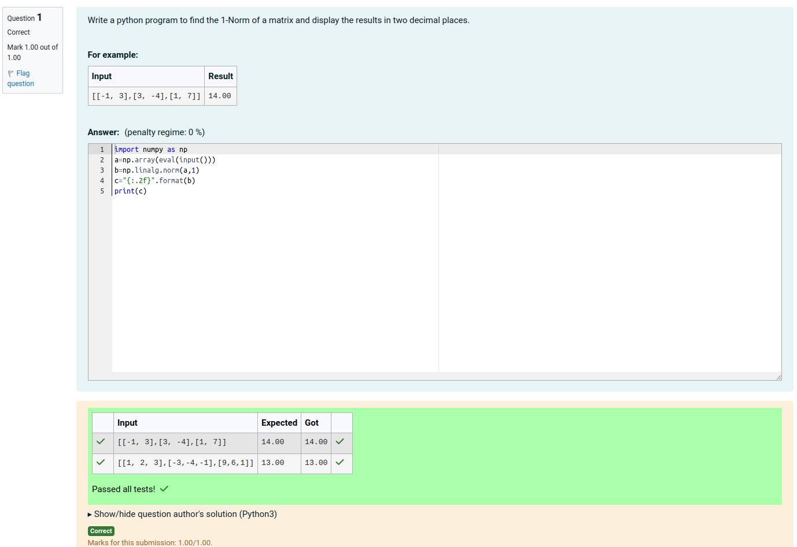
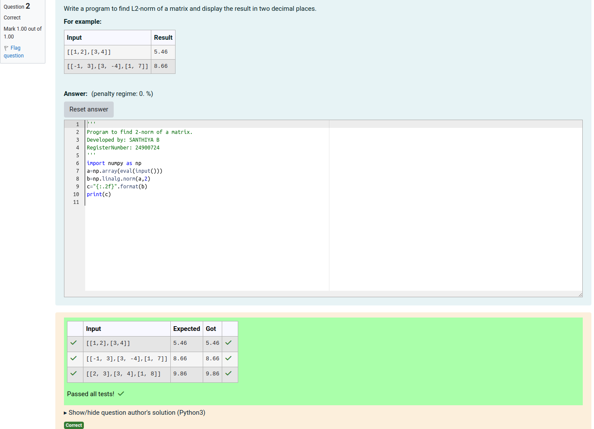
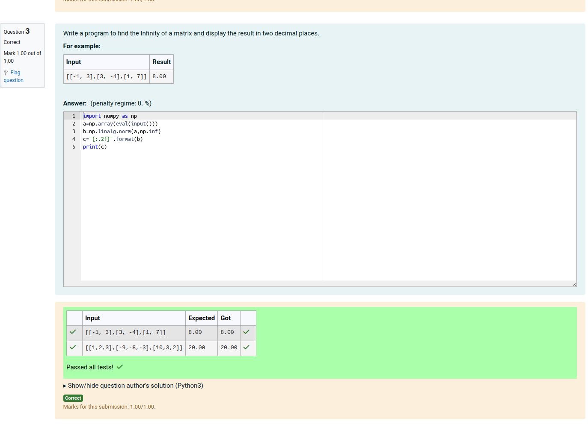

# Norm of a matrix
## Aim
To write a program to find the 1-norm, 2-norm and infinity norm of the matrix and display the result in two decimal places.
## Equipment’s required:
1.	Hardware – PCs
2.	Anaconda – Python 3.7 Installation / Moodle-Code Runner
## Algorithm:
	1. Get the input matrix using np.array()   
    2. Find the 2-norm of the matrix using np.linalg.norm()
	3. Print the norm of the matrix in two decimal places.
## Program:
```Python
# Register No: 24900724
# Developed By: SANTHIYA B
# 1-Norm of a Matrix

import numpy as np
a=np.array(eval(input()))
b=np.linalg.norm(a,1)
c="{:.2f}".format(b)
print(c)

```


# 2-Norm of a Matrix
```
Program to find 2-norm of a matrix.
Developed by: SANTHIYA B
RegisterNumber: 24900724

import numpy as np
a=np.array(eval(input()))
b=np.linalg.norm(a,2)
c="{:.2f}".format(b)
print(c)
```


# Infinity Norm of a Matrix

```
Developed by: SANTHIYA B
RegisterNumber: 24900724

import numpy as np
a=np.array(eval(input()))
b=np.linalg.norm(a,np.inf)
c="{:.2f}".format(b)
print(c)
```


```
## Output:
### 1-Norm of a Matrix


### 2-Norm of a  Matrix


### Infinity Norm of a Matrix


## Result
Thus the program for 1-norm, 2-norm and Infinity norm of a matrix are written and verified.
